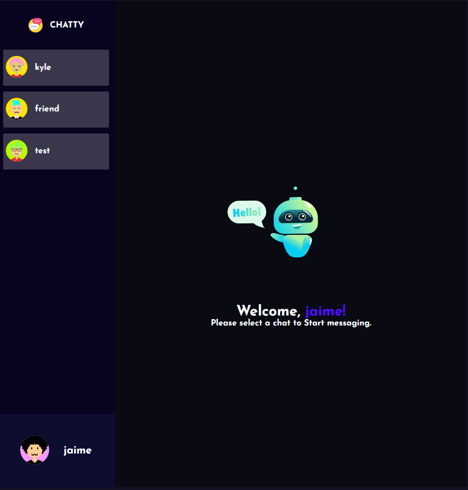
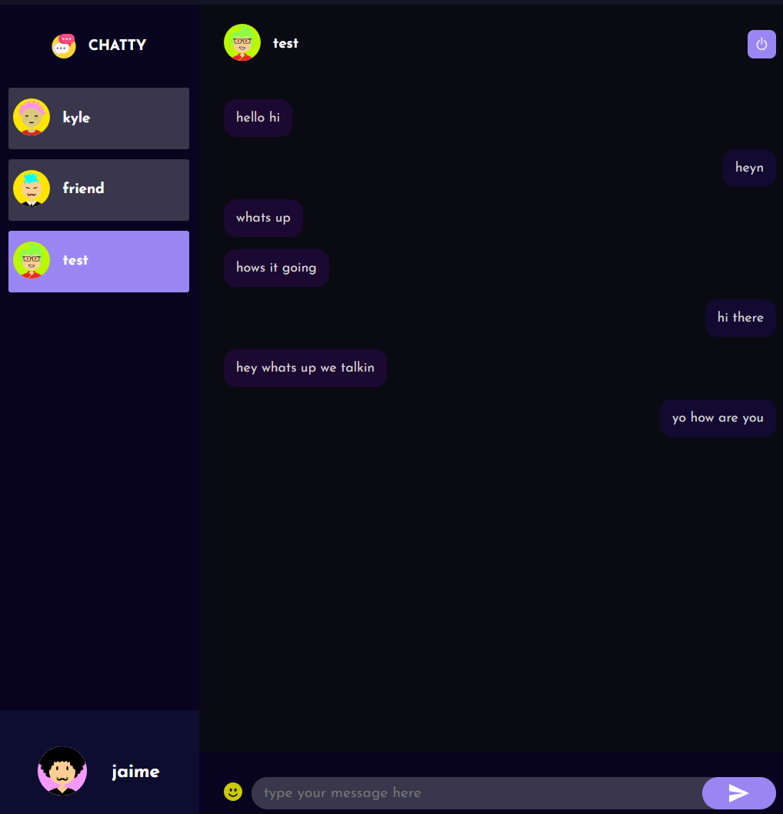
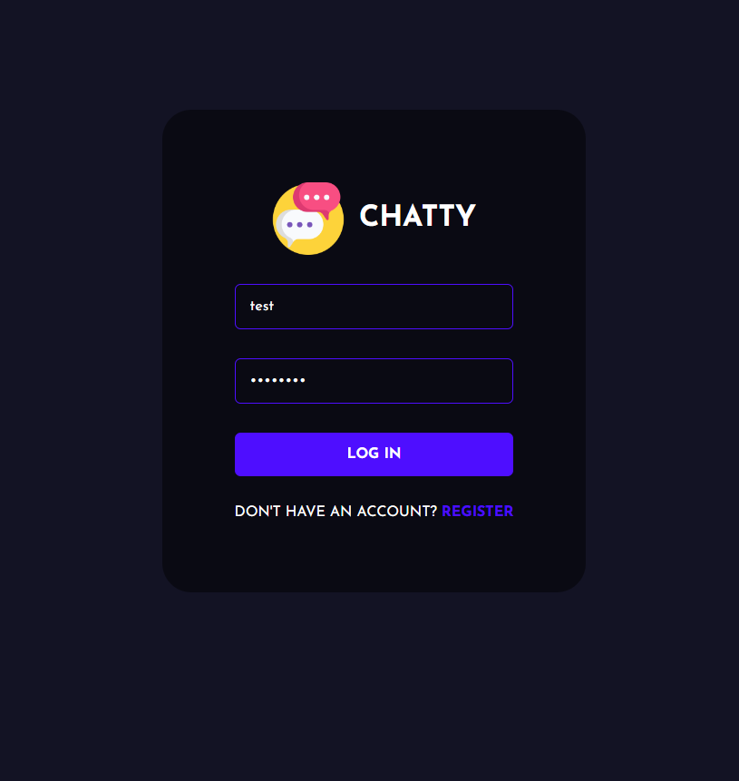
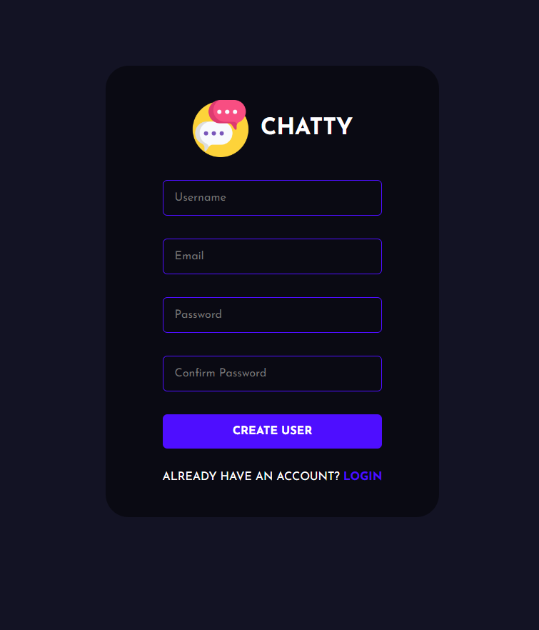
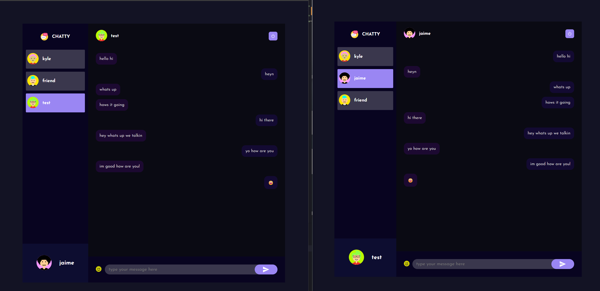

## EDIT FEB 4, 2024
.env file removed.

## Description
A real-time chat application built in MongoDB, Express, React, and Node.js, with Socket.io providing real-time communication between two client instances. I wanted to explore making some kind of messaging interface and was able to do so through this project. 

## Features 

## Running the project locally 
- Clone the repository onto your local machine.
- Make sure that you have Node.js installed. 
- Open the project in a code editor of your choice.
- Open an instance of the terminal.

## Important information 
- In order to run the program, you will need to have both the client and server code running on separate instances of the terminal. Instructions on how to run the code are outlined below.
- When running the program on two separate instances, you might have to refresh the page in order to let the most recent messages load in. 

## Running the client code
- Navigate to the "client" folder.
- Enter "yarn" to install all the required dependencies. 
- Enter "yarn start". 

## Running the server code
- Navigate to the "server" folder.
- Enter "yarn" to install all the required dependencies. 
- Enter "yarn start".

## Try it yourself! 
- You can have a real-time conversation between yourself and well..yourself! After running the server code, try running two instances of the client and have them talk to each other! 

The logo for this project was taken from Flaticon. 

The integration with Socket.io, the project structure and its styles were largely based on the work of Kishan Sheth on YouTube. Thank you, Kishan! 
